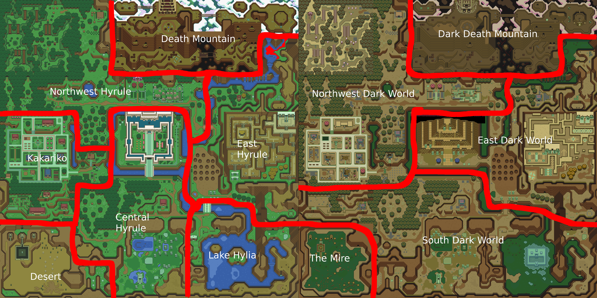

Hint description:

Hints will appear in the following ratios across the 15 telepathic tiles that have hints and the five storyteller locations:

Hint distribution for crossed entrance / crossed dungeon:

* 4 hints for inconvenient entrances.
* 2 hints for random entrances (this can by coincidence pick inconvenient entrances that aren't used for the first set of hints).
* 1 hints for inconvenient item locations.
* 7 hints for valuable items
* 1 hint for the Thieves Town attic
* 5 district hints

More vanilla shuffles of entrances reduces the number of inconvenient and random entrances hinted and generally follows adjustments in the ER_hint_reference.

Non-crossed door shuffles removes the attic hint and reduces the number of interesting items hinted at.

### Inconvenient entrance list

* Skull Woods Final
* Ice Palace
* Misery Mire
* Turtle Rock
* Ganon's Tower
* Mimic Ledge
* SW DM Foothills Cave (mirror from upper Bumper ledge)
* Hammer Pegs (near purple chest)
* Super Bomb cracked wall

### Inconvenient location list

* Purple Chest
* Spike Cave
* Magic Bat
* Sahasrahla (Green Pendant)

The following are included only if door shuffle is vanilla:

* Swamp left (two chests)
* Mire left (two chests)
* Hera basement
* Eastern Palace Big Key chest (protected by anti-fairies)
* Thieves' Town Big Chest
* Ice Palace Big Chest
* Ganon's Tower Big Chest

In the vanilla, dungeonssimple, and dungeonsfull shuffles, the following two locations are added to the inconvenient locations list:

* Graveyard Cave
* Mimic Cave

### Valuable items

Valuable Items are simply all items that are shown on the pause subscreen (Y, B, or A sections) minus Silver Arrows and plus Triforce Pieces, Magic Upgrades (1/2 or 1/4), and the Single Arrow. If key shuffle is being used, you can additionally get hints for Small Keys or Big Keys but not hints for Maps or Compasses.

### District Hints

These replace all junk/joke hints.

Each dungeon is considered its own district. The overworld is divided into districts as according to this picture:

Each district is classified in one of five categories:

* Foolish
* Connector Only
* Dungeon Only
* Useful
* Vital

A vital district contains one or more vital items. This includes:
* Y Items: Bows, Hookshot, Both Rods, Bombos, Lamp, Hammer, Ocarina, Book, Cane of Somaria, Mirror
* A Items: Gloves, Moon Pearl, Boots, Flippers
* All Swords, Triforce Pieces, and the Silver Arrows
* Ether and Quake if used to open an entrance
* Big Keys, Small Keys, Bomb Bags, Arrow Quivers in the appropriate mode (wild big keys, wild small keys, bomb bag, retro + shopsanity)

The hint will name the item if there is only one vital one, or give the number otherwise.

Useful district contain one or more useful items, but no vital items.

* Y Items: Boomerangs, Magic Powder, Mushroom, Shovel, Bug Net, Bottles, Cane of Byrna, Cape
* Ether and Quake if not used to open an entrance
* Shields, Mails, Magic Upgrades

Notably, the fetch items may technically be required depending on what is located at the fetch quest, but are considered useful still.

The hint will name the item if there is only one, or give the number of useful items otherwise.

A "Dungeon Only" district has no vital or useful items but contains one dungeon or more. The hint will pick one of the dungeon and state: "{district} is on the path to {dungeon}"

A "Connector Only" district has no vital or useful items but contains a connector that reaches a potentially inaccessible area like
the Turtle Rock upper ledge or the Maze Race (you have no mirror yet). The hint will state "{district} can reach {region}"

Foolish districts have no dungeons, no potentially useful connector and no useful or vital items. These districts, if they exist, are preferred for hints. The others are chosen randomly. 